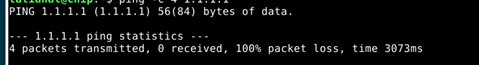

(x)

------
Log in was not accepted after Linux had been installed. After VM restarting login passed. 

$ sudo apt-get -y dist-upgrade

After the command terminal responded about 0 upgraded. Guess there was nothing to upgrade.

Firewall was installed successful.

All tabs of Menu Bar were hidden including “Device” tab. Used ChatGpt to figure it out how to make them visible.

After VBoxLinuxAdditions.run was installed, the screen became smaller than it was. The was a warring while installation: 

The installer couldn’t compile the modules, so features like auto-resize and shared folders won’t work until this is fixed. 

Used ChatGpt to get right command to install required headers: $sudo apt install linux-headers-amd64

-------
a)	Ping 4 times did not receive responses as expected, as networking was disabled.
Ping 1.1.1.1 sends packet to Cloudfare DNS server. Information Security.
-c 4  means it sends 4 packets and then stop automatically. ChatGpt

ping  8.8.8.8. sends packet to Google DNS server. Information Security. 4 packets transmitted and 4 responses received.

-----

b)	First I need to install nmap 

$sudo apt-get -y install nmap .Information Security.

-	Nmap scan report for localhost (127.0.0.1)
  	-starts scanning VM itself, not the host or internet.
 	
-	Host is up (0.00011s latency).

  Time that takes to the computer responded to Nmap’s request.
  
-	Other addresses for localhost (not scanned): ::1
  
Nmap noticed that the machine also has an IPv6 address (::1) but didn’t scan it. 

-	Not shown: 999 closed tcp ports (reset)
  
Nmap scanned 1000 common TCP ports. 999 have no service listening on those ports. Only the open port is listed below.

		PORT - 631  
		STATE - open (service is running)  
		SERVICE - ipp (Internet Printing Protocol)  
		VERSION - CUPS 2.4 (Common Unix Printing System, the printer service running on Linux)
  
-	 |_http-title: Home - CUPS 2.4.10
  
Shows the title of the web page that runs on port (CUPS admin page).

-	 | http-robots.txt: 1 disallowed entry
  
robots.txt is a special file websites use to tell search engines (like Google) which pages not to index. “1 disallowed entry” tells that the file contains one rule telling crawlers not to visit some page.

-	|_http-server-header: CUPS/2.4 IPP/2.1
  
This is what the server sends in its response headers. It tells that software is running:

CUPS/2.4 - version of the printing system

IPP/2.1 - version of the Internet Printing Protocol

-	Device type: general purpose
  
Devise has general purpose, is not a printer or router.

-	Running: Linux 2.6.X|5.X
  
Tells which OS kernel version is running.

-	OS CPE: cpe:/o:linux:linux_kernel:2.6.32 cpe:/o:linux:linux_kernel:5 cpe:/o:linux:linux_kernel:6
  
This is identifier for the operating system version.

-	OS details: Linux 2.6.32, Linux 5.0 - 6.2
  
Short readable version info.

-	Network Distance: 0 hops
  
Tells that the scanned machine is local, there are no routers in between.

-	Nmap done: 1 IP address (1 host up) scanned in 8.65 seconds
  
Tells that only 1 host (localhost) was scanned, and it took 8.65 seconds.

-----

c)	After apache2 was installed:

-	Not shown: 998 closed tcp ports (reset)
  
Nmap scanned 1000 common TCP ports. 998 have no service listening on those ports.

Now there are two open ports, one of them is 80/tcp  open  http    Apache httpd 2.4.65 ((Debian)):
PORT – 80

is the standard web port for HTTP traffic. HTTP (HyperText Transfer Protocol).

	STATE - open 

Tells that Apache web server is running and listening on this port.

	SERVICE – http
Tells that the protocol used on this port is HTTP, language web browsers and web servers use to communicate.

	VERSION - Apache 2.4.65 on Debian 
 
Is the software running the service and its version.

-	|_http-server-header: Apache/2.4.65 (Debian)
  
Tells  the software and its version.

-	|_http-title: Apache2 Debian Default Page: It works
  
The web page title (shown in the browser tab).

-	Nmap done: 1 IP address (1 host up) scanned in 8.52 seconds
  
The scan was faster.

-----

d)	First I need SSH client software to be installed:
$ sudo apt install openssh-client

Finally I'm here.

  
----
References:
-	Information Security. Information Security - 2025 early autumn - ICI002AS2AE-3007.
  
[https://terokarvinen.com/information-security/#h3-hello-lab]
-	Medium.

[https://medium.com/@.Qubit/how-to-create-open-find-remove-dashed-filename-in-linux-27ee297d1740]

