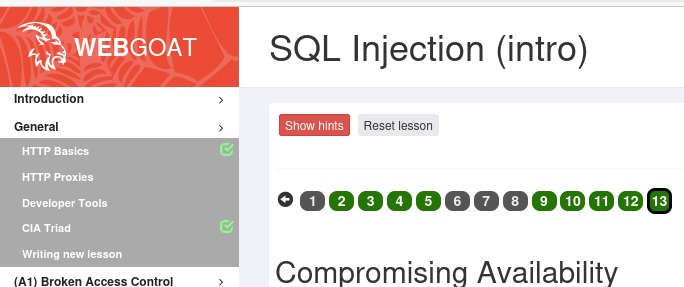

## A01:2021 – Broken Access Control. (OWASP Top 10:2021. Broken Access Control.)

It was the most widespread case in the list of risks Representing threat of security of the web App named in 2021.

The common reasons that cause the possibility of this threat are:

- Availability of information by an unauthorized user or incorrect distribution of user roles.

- Possibility to modify API requests, URLs, parameters, internal state, or HTML pages to bypass access controls.

- Accessing other users’ accounts via exposed identifiers, manipulating tokens, cookies, or hidden fields, and elevating privileges (acting as admin or unauthenticated user).

- Missing API controls for POST, PUT, or DELETE, force browsing to restricted pages, and misconfigured CORS allowing access from untrusted origins.

To avoid possible risks, it is recommended to:

-  Enforce access control only on trusted server-side code or secure APIs.
  
-  Reuse access control mechanisms throughout the application.
  
-  Minimize CORS.
   
-  Enforce record ownership and business rules.
  
-  Remove sensitive files from web roots.
  
-  Log failures and alert admins.
 
-  Rate-limit access and invalidate sessions or use short-lived JWTs.

  ## A05:2021 – Security Misconfiguration. (OWASP Top 10:2021. Security Misconfiguration.)
  
  It is a common and growing risk, especially in highly configurable software.

Vulnerabilities typically stem from:

-  improper setup
  
-  missing hardening
  
-  insecure defaults
  
-  outdated components
  
-  inconsistent configurations across environments

Effective prevention requires a repeatable, automated hardening process, 
minimizing unnecessary features, enforcing secure architecture and separation of components, 
applying security directives, and continuously verifying configurations across all environments.

## A06:2021 – Vulnerable and Outdated Components. (OWASP Top 10:2021. Vulnerable and Outdated Components.)

Is a frequent risk affecting client-side, server-side, and nested dependencies.

Risks increase when organizations do not track component versions, fail to patch or upgrade in a timely manner, or use unsupported or unmaintained software.

Effective prevention requires continuous inventory and monitoring of components, 
automated vulnerability scanning, secure sourcing, timely patching, 
and an ongoing update and configuration management process for the lifetime of the application.

## A03:2021 – Injection. (OWASP Top 10:2021. Injection.)

Injection remains one of the most critical risks, arising when untrusted user input is directly
included in commands or queries without proper validation, sanitization, or parameterization. 
This allows attackers to manipulate SQL, NoSQL, OS commands, or LDAP requests to access or modify sensitive data. 

The key defense is using safe APIs, parameterized queries, or migrates to Object Relational Mapping Tools (ORMs), careful validation. 
Use automated testing and security tools to detect flaws early.

## Munroe

Smart joke highlighting the app’s weak injection protection.

----
## a) Goat. Install WebGoat 2023.4.

Updated Linux package lists with: **$ sudo apt-get update**

Attempted to install OpenJDK 17 JRE **$ sudo apt-get install openjdk-17-jre** Received: "Package openjdk-17-jre is not available, but is referred to by another package."

Followed ChatGPT’s advice and installed Java using the default JDK: **$ sudo apt-get install default-jdk** 

Java version is 21.0.8 2025-07-15

Tried to install **$ wget https://github.com/WebGoat/WebGoat/releases/download/v2023.4/webgoat-2023.4.jar**

Received wget: command not found. 

As none of the steps in the instructions worked as described, and I do not have sufficient knowledge of Linux and its commands, I had to seek advice from ChatGPT.

Next step was to install wget.

## b) F12. Solve Webgoat 2023.4: General: Developer tools and A1 Injection (intro)

## d) Sequel. Solve SQLZoo:

Completed all SELECT and JOIN tasks in SQL Zoo to refresh knowledge.

## e) Solve Portswigger Labs: 

**SQL injection vulnerability in WHERE clause allowing retrieval of hidden data**

I carefuly read information on SQL injection topic (SQL injection.) to understand what and where I have to modify or edit to solve the lab. I used " '-- " after the request in URL line.

**'** closes the string properly after name of the Category.

**--** starts a SQL comment, which ignores the rest of the line. So if there are additional rules, conditions, or restrictions in the query they won't be executed.

This allows me to see all products in the category, even those that were hidden.

## n) Voluntary bonus: solve some Portswigger labs marked as Apprentice (easy level)

Solved SQL injection vulnerability allowing login bypass lab.

----

## References 

OWASP Top 10:2021, Broken Access Control. [https://owasp.org/Top10/A01_2021-Broken_Access_Control/]

OWASP Top 10:2021, Injection. [https://owasp.org/Top10/A03_2021-Injection/]

OWASP Top 10:2021, Security Misconfiguration. [https://owasp.org/Top10/A05_2021-Security_Misconfiguration/]

OWASP Top 10:2021, Vulnerable and Outdated Components [https://owasp.org/Top10/A06_2021-Vulnerable_and_Outdated_Components/]

SQL injection. [https://portswigger.net/web-security/sql-injection]
