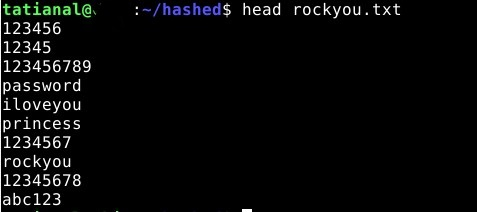
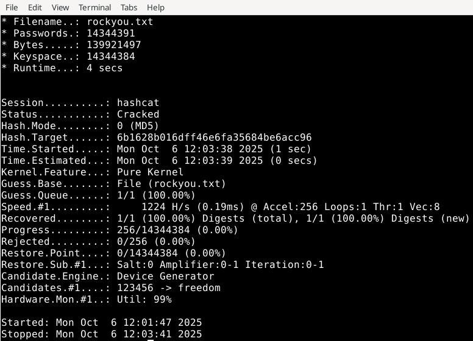
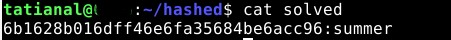
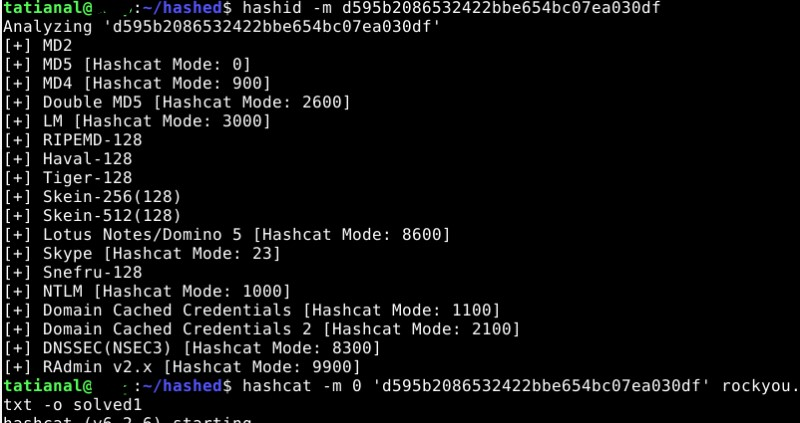
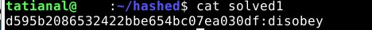

# (X)
A **one-way function** is a core concept in public-key cryptography. It is easy to compute but hard to reverse. 
A special kind of one-way function uses a secret value **(y)** that allows the original input **(x)** to be efficiently recovered from **f(x)** when y is known.

A **one-way hash function**—also called a message digest, fingerprint, or cryptographic checksum—converts variable-length input (**the pre-image**) 
into a fixed-length output (**the hash value**). It must be **collision-free**, meaning it’s difficult to find two different inputs producing the same hash. 
The process is public, and its security relies on being one-way (hard to invert).

A message authentication code (MAC) extends a hash function by adding a secret key. The output depends on both the message and the key, and only someone with the key can verify it.

# a, b)

I followed the instructions, installed Hashcat, and downloaded the dictionary.

Started the analysis and got the following result:

I chose MD5 (mode 0) and started the cracking process.:

The hash was cracked with the following result:

I repeated the previous three steps, and the result of the cracked hash is:

----------
References:

Schneier 2015: Applied Cryptography: 2.3 One-Way Functions and 2.4 One-Way Hash Functions. https://learning.oreilly.com/library/view/applied-cryptography-protocols/9781119096726/10_chap02.html#chap02-sec003

Tero Karvinen (2025) Cracking Passwords with Hashcat https://terokarvinen.com/2022/cracking-passwords-with-hashcat/
